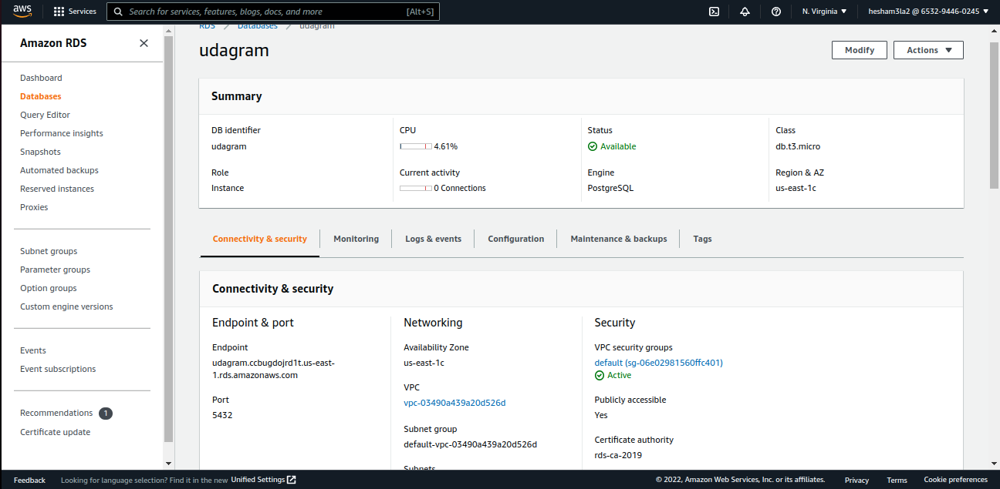
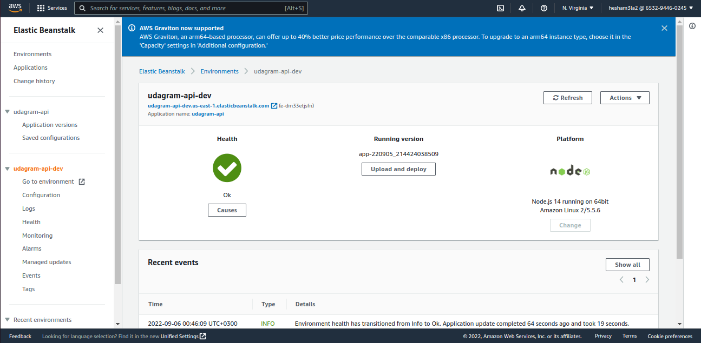
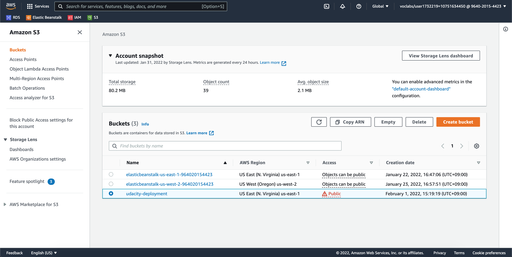

## RDS (Postgres database):

postgres database was created through RDS and connection data was provided to endpoint
connection data:
-username: postgres
-password: postgres
-database: postgres
-host: udagram.ccbugdojrd1t.us-east-1.rds.amazonaws.com
-post: 5432

## Elastic Beanstalk (Endpoint):

API URL: [http://udagram-api-dev.us-east-1.elasticbeanstalk.com/](http://udagram-api-dev.us-east-1.elasticbeanstalk.com/)

## S3 (app hosting)

web app URL: [http://udagram-1987.s3-website-us-east-1.amazonaws.com](http://udagram-1987.s3-website-us-east-1.amazonaws.com)

